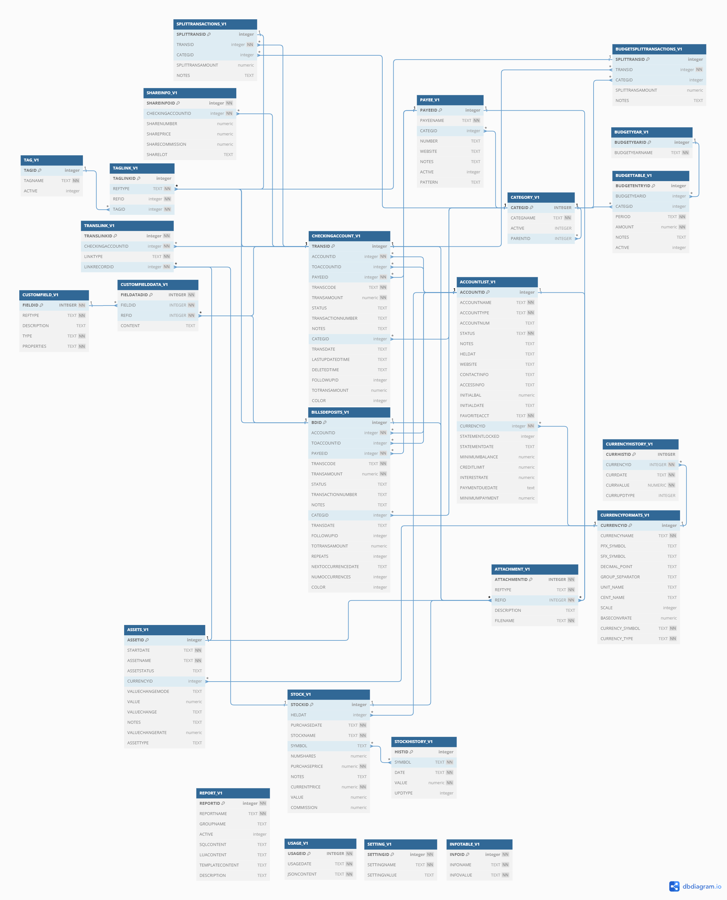

database
========

## Schema

Available in [tables.sql](tables.sql) file.

## UML

Relations not implemented at SQL level:

* CUSTOMFIELDDATA.REFID (depends on CUSTOMFIELD.REFTYPE)
* ATTACHMENT.REFID (depends on ATTACHMENT.REFTYPE)
* TRANSLINK.LINKRECORDID (depends on TRANSLINK.LINKTYPE)

## Initialization

|CATEGID | SUBCATEGID | name
|:------:|:----------:|--------------
|    1   |            | Bills
|    1   |      1     | - Telephone
|    1   |      2     | - Electricity
|    1   |      3     | - Gas
|    1   |      4     | - Internet
|    1   |      5     | - Rent
|    1   |      6     | - Cable TV
|    1   |      7     | - Water
|    2   |            | Food
|    2   |      8     | - Groceries
|    2   |      9     | - Dining out
|    3   |            | Leisure
|    3   |     10     | - Movies
|    3   |     11     | - Video Rental
|    3   |     12     | - Magazines
|    4   |            | Automobile
|    4   |     13     | - Maintenance
|    4   |     14     | - Gas
|    4   |     15     | - Parking
|    4   |     16     | - Registration
|    5   |            | Education
|    5   |     17     | - Books
|    5   |     18     | - Tuition
|    5   |     19     | - Others
|    6   |            | Homeneeds
|    6   |     20     | - Clothing
|    6   |     21     | - Furnishing
|    6   |     22     | - Others
|    7   |            | Healthcare
|    7   |     23     | - Health
|    7   |     24     | - Dental
|    7   |     25     | - Eyecare
|    7   |     26     | - Physician
|    7   |     27     | - Prescriptions
|    8   |            | Insurance
|    8   |     28     | - Auto
|    8   |     29     | - Life
|    8   |     30     | - Home
|    8   |     31     | - Health
|    9   |            | Vacation
|    9   |     32     | - Travel
|    9   |     33     | - Lodging
|    9   |     34     | - Sightseeing
|   10   |            | Taxes
|   10   |     35     | - Income Tax
|   10   |     36     | - House Tax
|   10   |     37     | - Water Tax
|   10   |     38     | - Others
|   11   |            | Miscellaneous
|   12   |            | Gifts
|   13   |            | Income
|   13   |     39     | - Salary
|   13   |     40     | - Reimbursement/Refunds
|   13   |     41     | - Investment Income
|   14   |            | Other Income
|   15   |            | Other Expenses
|   16   |            | Transfer
