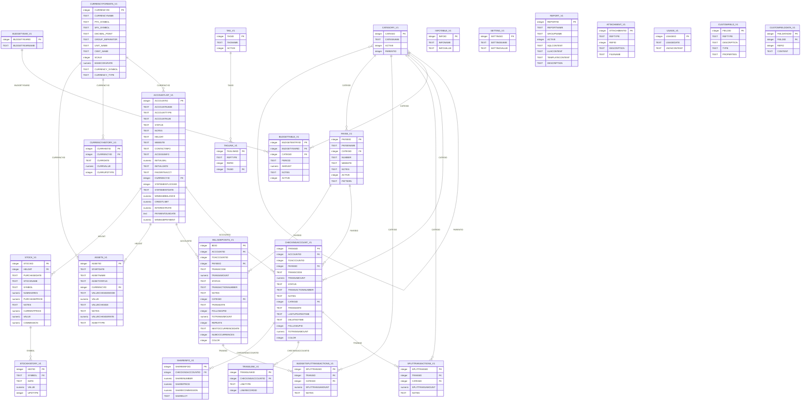

```mermaid
erDiagram
    ACCOUNTLIST_V1 ||--o{ CHECKINGACCOUNT_V1 : "ACCOUNTID"
    ACCOUNTLIST_V1 ||--o{ BILLSDEPOSITS_V1 : "ACCOUNTID"
    ACCOUNTLIST_V1 ||--o{ ASSETS_V1 : "HELDAT"
    ACCOUNTLIST_V1 ||--o{ STOCK_V1 : "HELDAT"
    CURRENCYFORMATS_V1 ||--o{ ACCOUNTLIST_V1 : "CURRENCYID"
    CURRENCYFORMATS_V1 ||--o{ CURRENCYHISTORY_V1 : "CURRENCYID"
    CURRENCYFORMATS_V1 ||--o{ ASSETS_V1 : "CURRENCYID"
    CATEGORY_V1 }|--o{ CATEGORY_V1 : "PARENTID"
    CATEGORY_V1 ||--o{ BUDGETTABLE_V1 : "CATEGID"
    CATEGORY_V1 ||--o{ CHECKINGACCOUNT_V1 : "CATEGID"
    CATEGORY_V1 ||--o{ SPLITTRANSACTIONS_V1 : "CATEGID"
    CATEGORY_V1 ||--o{ BUDGETSPLITTRANSACTIONS_V1 : "CATEGID"
    CATEGORY_V1 ||--o{ PAYEE_V1 : "CATEGID"
    PAYEE_V1 ||--o{ CHECKINGACCOUNT_V1 : "PAYEEID"
    PAYEE_V1 ||--o{ BILLSDEPOSITS_V1 : "PAYEEID"
    BUDGETYEAR_V1 ||--o{ BUDGETTABLE_V1 : "BUDGETYEARID"
    CHECKINGACCOUNT_V1 ||--o{ SPLITTRANSACTIONS_V1 : "TRANSID"
    BILLSDEPOSITS_V1 ||--o{ BUDGETSPLITTRANSACTIONS_V1 : "TRANSID"
    STOCK_V1 ||--o{ STOCKHISTORY_V1 : "SYMBOL"
    CHECKINGACCOUNT_V1 ||--o{ TRANSLINK_V1 : "CHECKINGACCOUNTID"
    CHECKINGACCOUNT_V1 ||--o{ SHAREINFO_V1 : "CHECKINGACCOUNTID"
    TAG_V1 ||--o{ TAGLINK_V1 : "TAGID"

    ACCOUNTLIST_V1 {
        integer ACCOUNTID PK
        TEXT ACCOUNTNAME
        TEXT ACCOUNTTYPE
        TEXT ACCOUNTNUM
        TEXT STATUS
        TEXT NOTES
        TEXT HELDAT
        TEXT WEBSITE
        TEXT CONTACTINFO
        TEXT ACCESSINFO
        numeric INITIALBAL
        TEXT INITIALDATE
        TEXT FAVORITEACCT
        integer CURRENCYID FK
        integer STATEMENTLOCKED
        TEXT STATEMENTDATE
        numeric MINIMUMBALANCE
        numeric CREDITLIMIT
        numeric INTERESTRATE
        text PAYMENTDUEDATE
        numeric MINIMUMPAYMENT
    }
    
    ASSETS_V1 {
        integer ASSETID PK
        TEXT STARTDATE
        TEXT ASSETNAME
        TEXT ASSETSTATUS
        integer CURRENCYID FK
        TEXT VALUECHANGEMODE
        numeric VALUE
        TEXT VALUECHANGE
        TEXT NOTES
        numeric VALUECHANGERATE
        TEXT ASSETTYPE
    }
    
    BILLSDEPOSITS_V1 {
        integer BDID PK
        integer ACCOUNTID FK
        integer TOACCOUNTID
        integer PAYEEID FK
        TEXT TRANSCODE
        numeric TRANSAMOUNT
        TEXT STATUS
        TEXT TRANSACTIONNUMBER
        TEXT NOTES
        integer CATEGID FK
        TEXT TRANSDATE
        integer FOLLOWUPID
        numeric TOTRANSAMOUNT
        integer REPEATS
        TEXT NEXTOCCURRENCEDATE
        integer NUMOCCURRENCES
        integer COLOR
    }
    
    BUDGETSPLITTRANSACTIONS_V1 {
        integer SPLITTRANSID PK
        integer TRANSID FK
        integer CATEGID FK
        numeric SPLITTRANSAMOUNT
        TEXT NOTES
    }
    
    BUDGETTABLE_V1 {
        integer BUDGETENTRYID PK
        integer BUDGETYEARID FK
        integer CATEGID FK
        TEXT PERIOD
        numeric AMOUNT
        TEXT NOTES
        integer ACTIVE
    }
    
    BUDGETYEAR_V1 {
        integer BUDGETYEARID PK
        TEXT BUDGETYEARNAME
    }
    
    CATEGORY_V1 {
        integer CATEGID PK
        TEXT CATEGNAME
        integer ACTIVE
        integer PARENTID
    }
    
    CHECKINGACCOUNT_V1 {
        integer TRANSID PK
        integer ACCOUNTID FK
        integer TOACCOUNTID
        integer PAYEEID FK
        TEXT TRANSCODE
        numeric TRANSAMOUNT
        TEXT STATUS
        TEXT TRANSACTIONNUMBER
        TEXT NOTES
        integer CATEGID FK
        TEXT TRANSDATE
        TEXT LASTUPDATEDTIME
        TEXT DELETEDTIME
        integer FOLLOWUPID
        numeric TOTRANSAMOUNT
        integer COLOR
    }
    
    CURRENCYHISTORY_V1 {
        integer CURRHISTID PK
        integer CURRENCYID FK
        TEXT CURRDATE
        numeric CURRVALUE
        integer CURRUPDTYPE
    }
    
    CURRENCYFORMATS_V1 {
        integer CURRENCYID PK
        TEXT CURRENCYNAME
        TEXT PFX_SYMBOL
        TEXT SFX_SYMBOL
        TEXT DECIMAL_POINT
        TEXT GROUP_SEPARATOR
        TEXT UNIT_NAME
        TEXT CENT_NAME
        integer SCALE
        numeric BASECONVRATE
        TEXT CURRENCY_SYMBOL
        TEXT CURRENCY_TYPE
    }
    
    INFOTABLE_V1 {
        integer INFOID PK
        TEXT INFONAME
        TEXT INFOVALUE
    }
    
    PAYEE_V1 {
        integer PAYEEID PK
        TEXT PAYEENAME
        integer CATEGID FK
        TEXT NUMBER
        TEXT WEBSITE
        TEXT NOTES
        integer ACTIVE
        TEXT PATTERN
    }
    
    SPLITTRANSACTIONS_V1 {
        integer SPLITTRANSID PK
        integer TRANSID FK
        integer CATEGID FK
        numeric SPLITTRANSAMOUNT
        TEXT NOTES
    }
    
    STOCK_V1 {
        integer STOCKID PK
        integer HELDAT FK
        TEXT PURCHASEDATE
        TEXT STOCKNAME
        TEXT SYMBOL
        numeric NUMSHARES
        numeric PURCHASEPRICE
        TEXT NOTES
        numeric CURRENTPRICE
        numeric VALUE
        numeric COMMISSION
    }
    
    STOCKHISTORY_V1 {
        integer HISTID PK
        TEXT SYMBOL FK
        TEXT DATE
        numeric VALUE
        integer UPDTYPE
    }
    
    SETTING_V1 {
        integer SETTINGID PK
        TEXT SETTINGNAME
        TEXT SETTINGVALUE
    }
    
    REPORT_V1 {
        integer REPORTID PK
        TEXT REPORTNAME
        TEXT GROUPNAME
        integer ACTIVE
        TEXT SQLCONTENT
        TEXT LUACONTENT
        TEXT TEMPLATECONTENT
        TEXT DESCRIPTION
    }
    
    ATTACHMENT_V1 {
        integer ATTACHMENTID PK
        TEXT REFTYPE
        integer REFID
        TEXT DESCRIPTION
        TEXT FILENAME
    }
    
    USAGE_V1 {
        integer USAGEID PK
        TEXT USAGEDATE
        TEXT JSONCONTENT
    }
    
    CUSTOMFIELD_V1 {
        integer FIELDID PK
        TEXT REFTYPE
        TEXT DESCRIPTION
        TEXT TYPE
        TEXT PROPERTIES
    }
    
    CUSTOMFIELDDATA_V1 {
        integer FIELDATADID PK
        integer FIELDID FK
        integer REFID
        TEXT CONTENT
    }
    
    TRANSLINK_V1 {
        integer TRANSLINKID PK
        integer CHECKINGACCOUNTID FK
        TEXT LINKTYPE
        integer LINKRECORDID
    }
    
    SHAREINFO_V1 {
        integer SHAREINFOID PK
        integer CHECKINGACCOUNTID FK
        numeric SHARENUMBER
        numeric SHAREPRICE
        numeric SHARECOMMISSION
        TEXT SHARELOT
    }
    
    TAG_V1 {
        integer TAGID PK
        TEXT TAGNAME
        integer ACTIVE
    }
    
    TAGLINK_V1 {
        integer TAGLINKID PK
        TEXT REFTYPE
        integer REFID
        integer TAGID FK
    }
```
