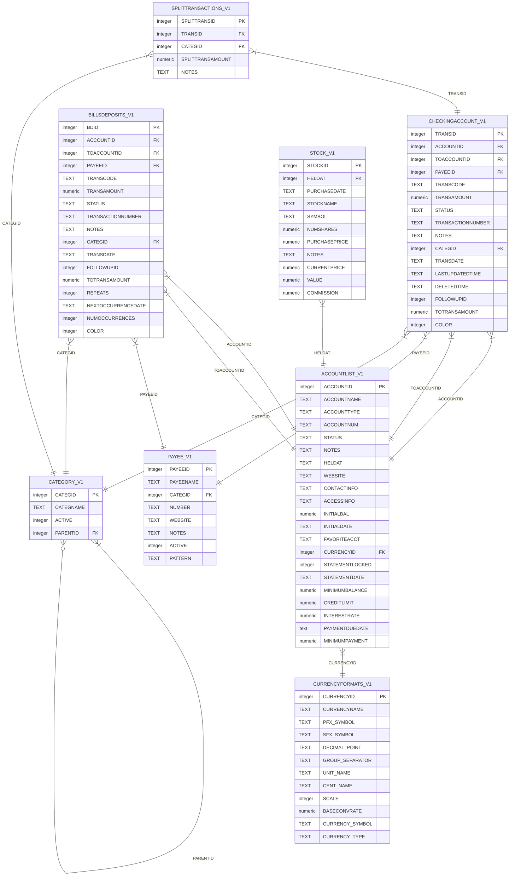

```mermaid
erDiagram
    ACCOUNTLIST_V1 {
        integer ACCOUNTID PK
        TEXT ACCOUNTNAME
        TEXT ACCOUNTTYPE
        TEXT ACCOUNTNUM
        TEXT STATUS
        TEXT NOTES
        TEXT HELDAT
        TEXT WEBSITE
        TEXT CONTACTINFO
        TEXT ACCESSINFO
        numeric INITIALBAL
        TEXT INITIALDATE
        TEXT FAVORITEACCT
        integer CURRENCYID FK
        integer STATEMENTLOCKED
        TEXT STATEMENTDATE
        numeric MINIMUMBALANCE
        numeric CREDITLIMIT
        numeric INTERESTRATE
        text PAYMENTDUEDATE
        numeric MINIMUMPAYMENT
    }

    CURRENCYFORMATS_V1 {
        integer CURRENCYID PK
        TEXT CURRENCYNAME
        TEXT PFX_SYMBOL
        TEXT SFX_SYMBOL
        TEXT DECIMAL_POINT
        TEXT GROUP_SEPARATOR
        TEXT UNIT_NAME
        TEXT CENT_NAME
        integer SCALE
        numeric BASECONVRATE
        TEXT CURRENCY_SYMBOL
        TEXT CURRENCY_TYPE
    }

    CATEGORY_V1 {
        integer CATEGID PK
        TEXT CATEGNAME
        integer ACTIVE
        integer PARENTID FK
    }

    PAYEE_V1 {
        integer PAYEEID PK
        TEXT PAYEENAME
        integer CATEGID FK
        TEXT NUMBER
        TEXT WEBSITE
        TEXT NOTES
        integer ACTIVE
        TEXT PATTERN
    }

    CHECKINGACCOUNT_V1 {
        integer TRANSID PK
        integer ACCOUNTID FK
        integer TOACCOUNTID FK
        integer PAYEEID FK
        TEXT TRANSCODE
        numeric TRANSAMOUNT
        TEXT STATUS
        TEXT TRANSACTIONNUMBER
        TEXT NOTES
        integer CATEGID FK
        TEXT TRANSDATE
        TEXT LASTUPDATEDTIME
        TEXT DELETEDTIME
        integer FOLLOWUPID
        numeric TOTRANSAMOUNT
        integer COLOR
    }

    SPLITTRANSACTIONS_V1 {
        integer SPLITTRANSID PK
        integer TRANSID FK
        integer CATEGID FK
        numeric SPLITTRANSAMOUNT
        TEXT NOTES
    }

    BILLSDEPOSITS_V1 {
        integer BDID PK
        integer ACCOUNTID FK
        integer TOACCOUNTID FK
        integer PAYEEID FK
        TEXT TRANSCODE
        numeric TRANSAMOUNT
        TEXT STATUS
        TEXT TRANSACTIONNUMBER
        TEXT NOTES
        integer CATEGID FK
        TEXT TRANSDATE
        integer FOLLOWUPID
        numeric TOTRANSAMOUNT
        integer REPEATS
        TEXT NEXTOCCURRENCEDATE
        integer NUMOCCURRENCES
        integer COLOR
    }

    STOCK_V1 {
        integer STOCKID PK
        integer HELDAT FK
        TEXT PURCHASEDATE
        TEXT STOCKNAME
        TEXT SYMBOL
        numeric NUMSHARES
        numeric PURCHASEPRICE
        TEXT NOTES
        numeric CURRENTPRICE
        numeric VALUE
        numeric COMMISSION
    }

    ACCOUNTLIST_V1 }|--|| CURRENCYFORMATS_V1 : "CURRENCYID"
    CATEGORY_V1 }|--o{ CATEGORY_V1 : "PARENTID"
    CHECKINGACCOUNT_V1 }|--|| ACCOUNTLIST_V1 : "ACCOUNTID"
    CHECKINGACCOUNT_V1 }|--|| ACCOUNTLIST_V1 : "TOACCOUNTID"
    CHECKINGACCOUNT_V1 }|--|| PAYEE_V1 : "PAYEEID"
    CHECKINGACCOUNT_V1 }|--|| CATEGORY_V1 : "CATEGID"
    SPLITTRANSACTIONS_V1 }|--|| CHECKINGACCOUNT_V1 : "TRANSID"
    SPLITTRANSACTIONS_V1 }|--|| CATEGORY_V1 : "CATEGID"
    BILLSDEPOSITS_V1 }|--|| ACCOUNTLIST_V1 : "ACCOUNTID"
    BILLSDEPOSITS_V1 }|--|| ACCOUNTLIST_V1 : "TOACCOUNTID"
    BILLSDEPOSITS_V1 }|--|| PAYEE_V1 : "PAYEEID"
    BILLSDEPOSITS_V1 }|--|| CATEGORY_V1 : "CATEGID"
    STOCK_V1 }|--|| ACCOUNTLIST_V1 : "HELDAT"
```
